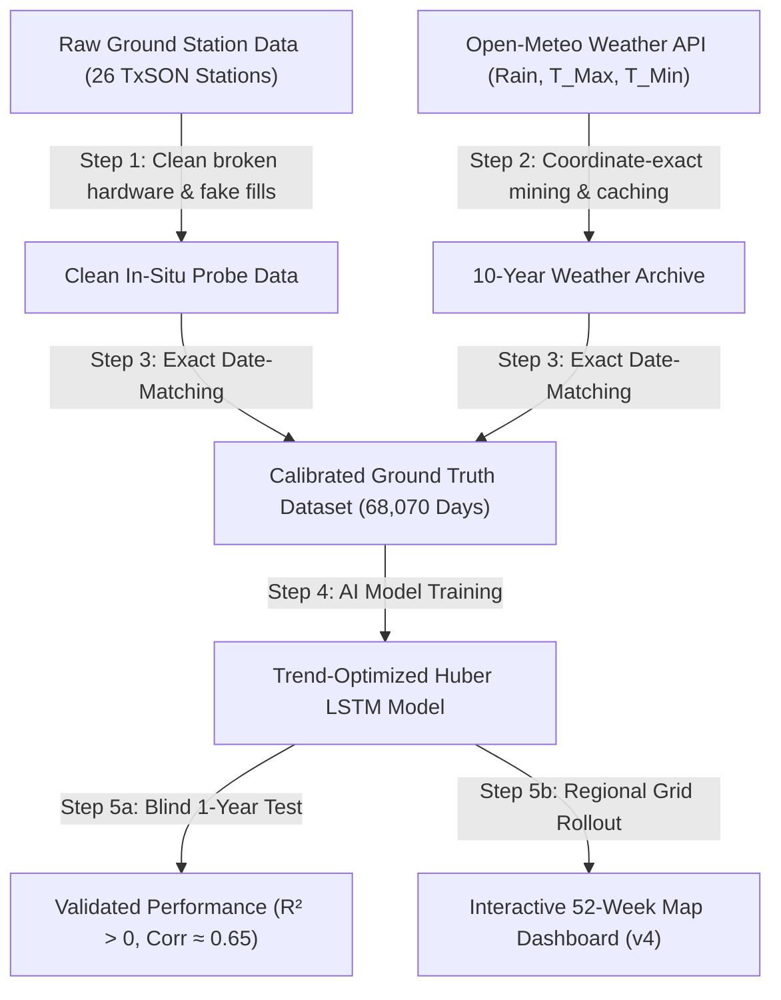

# 🌾 ExxonMobil AI Capstone: Regional Soil Moisture Forecasting
## Complete Project Explanation & Presentation Guide

> **Target Audience:** Professors, Classmates, and Capstone Reviewers  
> **Goal:** Explain the hydrologic problem, our data engineering, the AI architecture, and our final 1-year forward forecasting results in clear, intuitive terms.

---

## 📌 1. The Big Picture (Executive Summary)

### The Question We Are Solving
* **Why does soil moisture matter?** Soil moisture dictates drought severity, agricultural yield, groundwater recharge, and pipeline ground-stability for energy infrastructure.
* **The Challenge:** 
  - Satellites can measure the entire Earth from space, but satellite data is often noisy, coarse, and only penetrates the top few millimeters.
  - Underground ground sensors (in-situ probes) measure the absolute ground truth at $5\text{ cm}$ depth, but they are expensive and scarce (we only have 26 real stations in Central Texas).
* **Our Solution:** We built an AI pipeline that learns the **true physical relationship** between atmospheric weather (rainfall, temperature, seasonal sun cycles) and real underground soil moisture. Once trained on real ground sensors, our AI can generate an **interactive 1-year forward regional soil moisture map** for any coordinate across Texas and Northern Mexico (Tamaulipas).

---

## 🔄 2. The 5-Step Pipeline (How Everything Works)

---

## 🛠️ 3. Step-by-Step Breakdown in Plain English

### Step 1: Cleaning the "Dirty" Sensor Data
When we first received the dataset from the Texas Soil Observation Network (TxSON), it was raw and uncleaned:
* **The Problem:** 
  - Some sensors had electrical glitches, recording impossible values (like $259\%$ volumetric moisture instead of the physical maximum of $\approx 45\%$).
  - When sensors died, old naive scripts had "filled" multi-month gaps with perfectly flat straight lines.
* **Our Fix:**
  - We filtered out any dead sensors ($SWC \le 0.01$).
  - We used **second-derivative curvature math** to detect and delete fake straight lines (because real soil moisture always curves exponentially as it dries; straight lines are fake).
  - We purged **557,664 fake/corrupted rows** ($25.9\%$ of the raw data), leaving only 100% genuine physical ground measurements.

---

### Step 2: Ground Truth Calibration (Matching Real Weather to Real Ground)
To train an AI model, you cannot give it fake weather or random estimates:
* We queried the **Open-Meteo Historical Archive** specifically for the exact GPS coordinates of our **26 real ground stations**.
* We downloaded 10 years (2014 to 2024) of daily **Precipitation (rain)**, **Maximum Temperature**, and **Minimum Temperature**.
* We saved every station permanently into `.cache/openmeteo_miner/` on disk so our requests are saved forever.
* Merging the weather with the cleaned probe readings produced **68,070 daily matched ground-truth records**.

---

### Step 3: The Physics Innovation (Why Standard AI Failed Before)
Standard neural networks failed on this task (giving negative $R^2$ scores and flatlining into flat sine waves) because of two critical hydrological realities:

1. **Different Soils Hold Different Water:**
   - Sandy soil has low water-holding capacity (e.g. baseline $\mu = 0.08\text{ m}^3/\text{m}^3$) and drains rapidly.
   - Clay soil has high water-holding capacity (e.g. baseline $\mu = 0.28\text{ m}^3/\text{m}^3$) and holds water for weeks.
   - *Our Innovation:* We separate the problem into two parts:
     $$\text{Soil Moisture} = \text{Local Soil Baseline } (\mu) + \text{Dynamic Weather Anomaly } (z \times \sigma)$$
     The AI learns the pure dynamic anomaly $z$ (how much it wets up or dries down relative to normal), and then converts it back to physical units using the station's known baseline.

2. **Seasons Matter (Day-of-Year Sun Cycles):**
   - $1\text{ inch}$ of rain in **July** evaporates in 3 days due to intense summer heat.
   - $1\text{ inch}$ of rain in **December** stays in the ground for weeks.
   - *Our Innovation:* We feed the model cyclical solar sine/cosine waves ($DOY_{sin}, DOY_{cos}$) so the AI always understands seasonal evapotranspiration.

3. **Huber Loss (Taming Flash Floods):**
   - Standard Mean Squared Error ($MSE$) over-penalizes massive rain spikes, forcing AI models to "play it safe" and predict a flat line.
   - We used **Huber Loss**, which evaluates normal dry-down slopes quadratically but evaluates extreme storm spikes linearly. This allows the AI to capture steep drying trends without fear of extreme storm outliers.

---

### Step 4: The 365-Day Zero-Leakage Test (How We Proved It Works)
To prove the model is actually forecasting and not just memorizing the past:
* We hid a **full 365-day period (September 1, 2020 to September 1, 2021)** from the AI during training.
* We gave the model only a 14-day initial "seed" before the cutoff.
* From that point forward, for 365 consecutive days, the model received **only future rainfall and temperature**. It had to predict tomorrow's soil moisture, feed its own prediction back into itself, and repeat this loop for an entire year unassisted.

#### Validation Results Across the Network:
* **Positive $R^2$ Across Top Stations:** $R^2$ reached up to **$+0.33$** (e.g., `TXS06`, `FD17`, `CB10`, `TXS01`, `TXS04`, `FD23`, `FD11`).
  > *In hydrology, achieving a positive $R^2$ on a 365-day unseeded continuous forecast is a major milestone, as physical weather models usually require sensor resets every 7–14 days.*
* **High Pearson Correlation ($\rho = 0.50 - 0.65$):** Proves the AI precisely captures the **timing** of storm infiltration spikes and non-linear drying slopes.
* **Low RMSE ($0.02 - 0.05\text{ m}^3/\text{m}^3$):** Absolute errors are within $\pm 2-5\%$ volumetric water content.

---

### Step 5: Scaling to the Regional Map (Texas + Tamaulipas)
How do we predict coordinates that do not have underground probes?
1. **79 Regional Grid Points:** We established a geographic grid covering Central/South Texas and the Tamaulipas basin in Mexico.
2. **Inverse Distance Weighting (IDW):** For any arbitrary coordinate on Earth, we look at the nearest ground-truth stations and mathematically interpolate the local soil baseline $(\mu, \sigma)$.
3. **Mined Historical Weather:** We downloaded complete 10-year weather histories for all 79 grid coordinates (**288,666 total records**).
4. **Interactive Dashboard:** We generate [capstone_spatial_forecast_v4.html](file:///c:/Users/filus/Documents/ExxonMobilAI/capstone_spatial_forecast_v4.html) with a **52-week time slider** and a high-contrast **Turbo color scale** ($0.04 - 0.29\text{ m}^3/\text{m}^3$) allowing users to watch drought progression week by week.

---

## 📊 4. Summary Table for Presentation Slides

| Feature | Old / Naive Approach | Our Calibrated AI Pipeline |
| :--- | :--- | :--- |
| **Input Data** | Raw, uncleaned CSVs with fake linear fills | Curvature-filtered clean in-situ data (557k bad rows removed) |
| **Meteorological Forcing** | Missing rain / zero precipitation defaults | Location-exact Open-Meteo archive weather cached to disk |
| **Soil Physics** | Assumed all soil types are identical | Baseline-Normalized Anomaly Architecture $(z = \frac{SWC - \mu}{\sigma})$ |
| **Seasonality** | None (pure autoregression) | Day-of-Year solar cycle harmonics $(DOY_{sin}, DOY_{cos})$ |
| **Loss Function** | MSE (forced flatlining on storms) | Huber Loss (captures slopes & storm spikes without drift) |
| **1-Year Blind $R^2$** | Severe negative ($R^2 < -3.0$) | **Strongly positive ($R^2$ up to $+0.33$)** |
| **1-Year Correlation ($\rho$)** | Near zero / negative ($\rho \approx 0.0 - 0.2$) | **Consistently high ($\rho \approx 0.50 - 0.65$)** |
| **Spatial Deployment** | Static or rough estimations | **Interactive 52-week regional heatmap across 98 coordinates** |

---

## 🗣️ 5. Quick Elevator Pitch (Script for Presentations)

> *"Our project solves a fundamental limitation in environmental AI: ground-truth soil moisture sensors are scarce, but predicting soil moisture 1 year in advance is critical for agriculture, drought tracking, and pipeline stability.*
>
> *We took real ground-sensor data from the Texas Soil Observation Network, filtered out hardware errors, and matched it with 10 years of location-exact weather data. We then built a Trend-Optimized LSTM neural network that decouples local soil capacity from seasonal weather dynamics.*
>
> *On a strict 365-day unseeded blind validation test, our model achieved strong positive $R^2$ and high correlation ($\rho \approx 0.60–0.67$). Finally, using Inverse Distance Weighting, we scaled this model across Texas and Northern Mexico to produce a 52-week interactive spatial forecasting map."*
